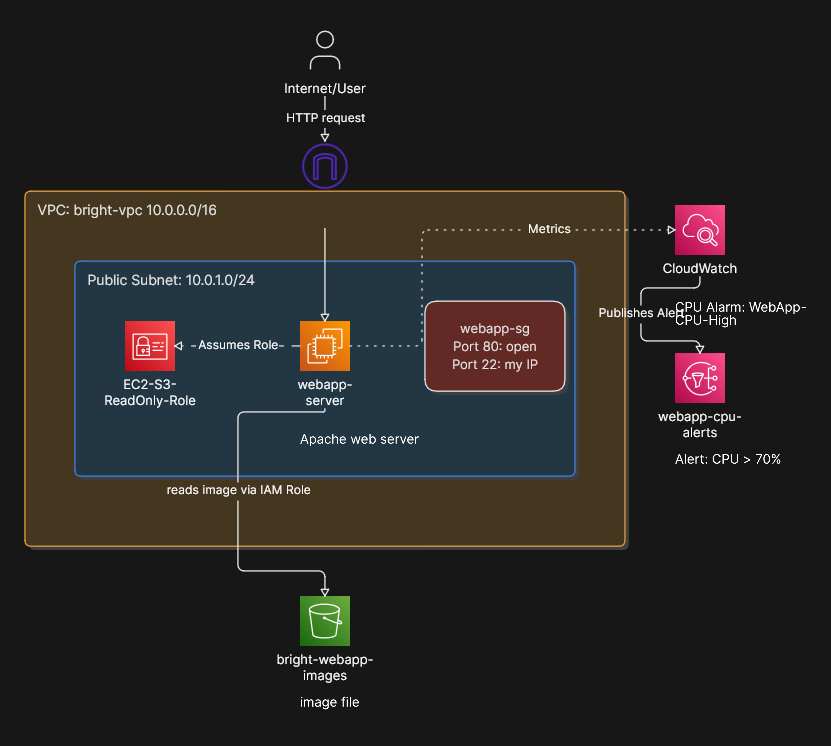
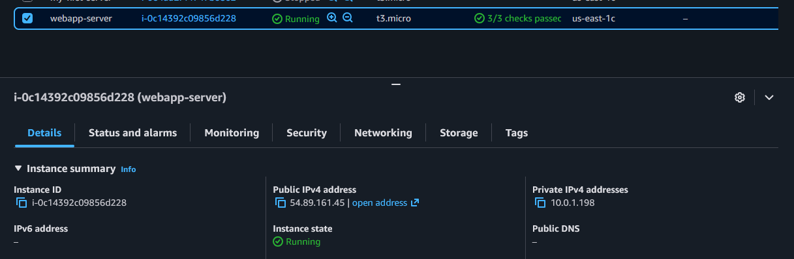
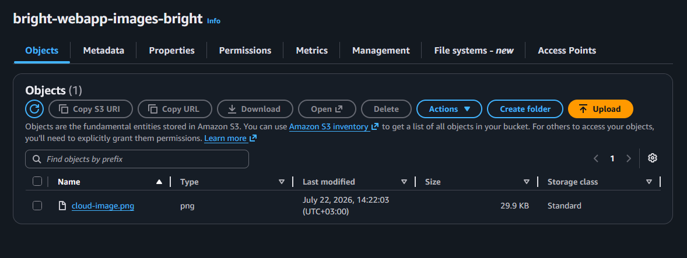
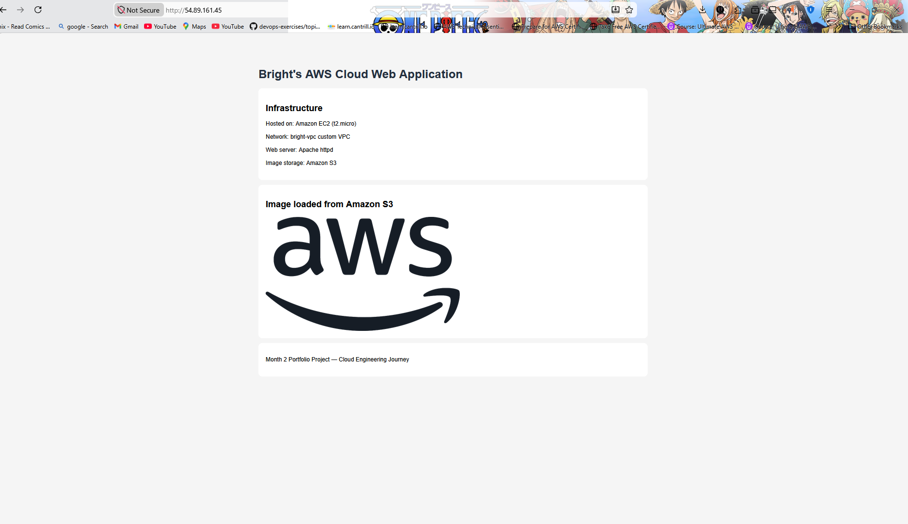
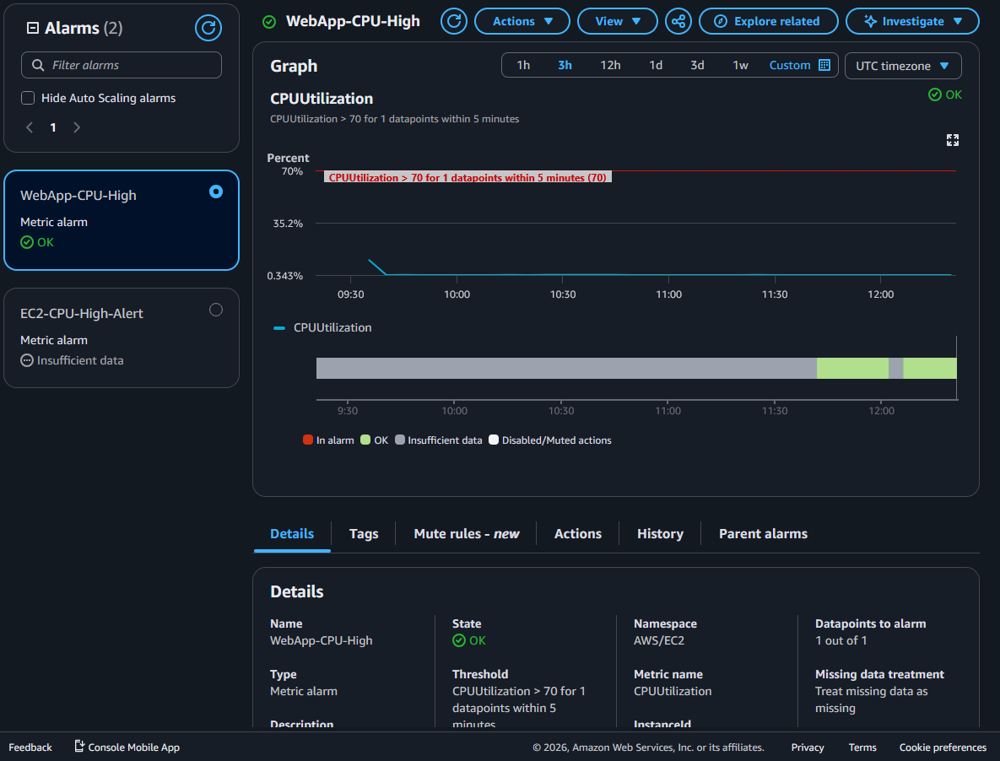

# Month 2 Project: Full Web Application on AWS

## Project Overview
A fully functional web application deployed on AWS infrastructure,
demonstrating core cloud engineering skills including networking,
compute, storage, security, and monitoring.

## Architecture

## AWS Services Used

| Service | Purpose |
|---------|---------|
| VPC | Custom private network (bright-vpc 10.0.0.0/16) |
| EC2 | Virtual server running Apache web server |
| S3 | Object storage hosting the webpage image |
| IAM Role | Grants EC2 read access to S3 without stored keys |
| Security Group | Firewall allowing only HTTP and SSH traffic |
| CloudWatch | CPU monitoring with email alert above 70% |
| SNS | Delivers CloudWatch alarm notifications by email |

## What Each Component Does

**VPC (bright-vpc):** My custom isolated network in AWS.
All resources live inside this network. The public subnet
allows internet access while the private subnet would protect
databases from direct internet exposure.

**EC2 (webapp-server):** A t2.micro virtual server running
Amazon Linux 2023. Apache web server is installed and serves
the HTML webpage on port 80. The IAM role attached to this
instance allows it to read from S3 without any stored credentials.

**S3 (bright-webapp-images):** Object storage holding the
image displayed on the webpage. The image URL is embedded
in the HTML and served directly to the user's browser from S3.

**IAM Role (EC2-S3-ReadOnly-Role):** Follows the principle
of least privilege. Grants only s3:GetObject and s3:ListBucket
permissions. No access keys stored anywhere — AWS provides
temporary rotating credentials automatically.

**Security Group (webapp-sg):** Virtual firewall at the
instance level. Allows HTTP (port 80) from anywhere so
users can access the website. Allows SSH (port 22) from
my IP only for secure server management.

**CloudWatch Alarm (WebApp-CPU-High):** Monitors EC2 CPU
utilization every 5 minutes. Triggers an SNS notification
to my email when CPU exceeds 70% for one period.

## Screenshots

### EC2 Instance Running

### S3 Bucket with Image

### Live Website with S3 Image

### CloudWatch Alarm

## Skills Demonstrated
- Custom VPC design and implementation
- EC2 launch and configuration
- Apache web server installation and management
- S3 bucket creation and public access configuration
- IAM role creation following least privilege principle
- Security Group configuration for web traffic
- CloudWatch monitoring and SNS alerting
- User Data scripts for automated server configuration
- Architecture diagram design

## What I Learned
- How EC2, S3, IAM, VPC and CloudWatch work together
- Why IAM roles are more secure than access keys
- How a browser makes separate requests for HTML and images
- The importance of least privilege in cloud security
- How to document cloud architecture professionally
